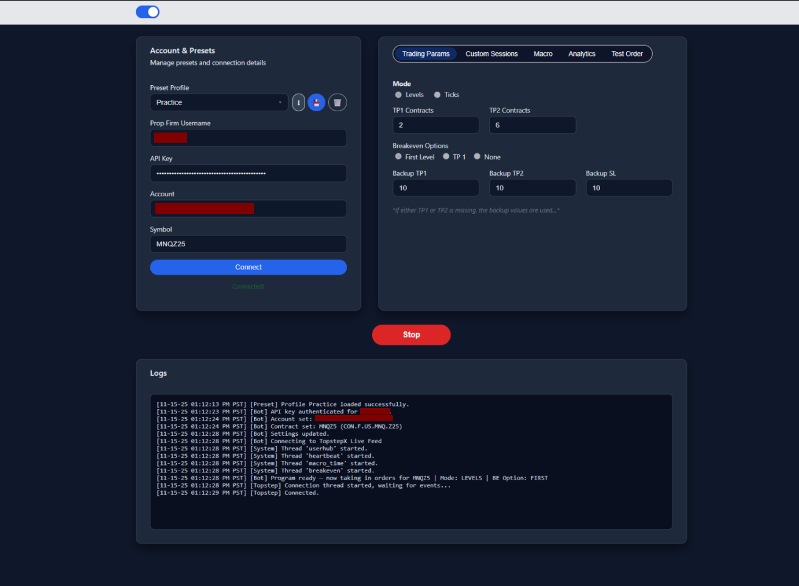
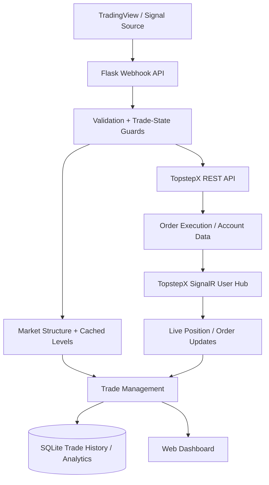

# Nezo

Nezo is a full-stack automated futures trading platform built with Python and Flask. It receives TradingView-style signals, validates trading state, integrates with TopstepX for order execution, manages bracket orders and break-even behavior, caches market structure for faster decisions, and records trade history for analytics.

## Dashboard Preview

Nezo includes a browser-based dashboard for managing connection settings, presets, trading parameters, session controls, and live operational logs.

## At a Glance

| Area | Details |
|---|---|
| Backend | Python, Flask, Requests, SQLite |
| Real-time | SignalR position, order, and trade events |
| Integrations | TopstepX REST API, TopstepX SignalR hub, TradingView-style webhooks |
| Reliability | duplicate-order protection, position guards, bracket cleanup, session controls |
| Data | rolling market-data cache, swing/FVG detection, trade analytics |

## Engineering Highlights

- **Python + Flask backend** for webhook ingestion, application state, settings, analytics, and trading controls
- **TopstepX REST API integration** for authentication, contracts, accounts, historical bars, order placement, cancellation, and position data
- **SignalR real-time updates** for positions, orders, and trade events
- **Duplicate-order and position guards** to reduce race conditions around rapid incoming signals
- **Market-structure engine** for swing highs/lows and fair value gaps used in dynamic stop-loss and take-profit selection
- **Incremental market-data cache** with locking and localized recalculation to reduce repeated API work
- **SQLite persistence** for trade history, analytics, and non-sensitive presets
- **Threaded background processes** for connection health, cache refreshes, and trade management
- **Web dashboard** for connection settings, strategy configuration, presets, logs, session controls, and analytics

## Architecture

## What This Project Demonstrates

Nezo is intended to show practical backend and integration engineering rather than just a trading strategy. The project demonstrates:

- designing around asynchronous external APIs and real-time event streams
- protecting order workflows from duplicate or conflicting state
- using locking and cached data to reduce repeated network work
- organizing trade state across REST requests, background threads, and SignalR callbacks
- persisting and querying application data with SQLite
- debugging edge cases across frontend, backend, and third-party integrations

## Main Modules

- `app.py` - Flask application, webhook flow, real-time event handling, trade state, and UI routes
- `topstepx_api.py` - TopstepX REST integration and order operations
- `levels.py` - market-bar retrieval, swing detection, FVG detection, and level selection
- `market_cache.py` - rolling market-data cache and incremental structure refresh
- `trades_db.py` - SQLite trade storage and analytics queries
- `preset_manager.py` - preset persistence with authentication secrets removed before storage
- `templates/` and `static/` - browser dashboard

## Reliability and Safety Controls

Nezo includes several controls intended to make automated execution safer and more deterministic:

- blocks new entries when an existing position is detected
- serializes trade-entry handling to reduce duplicate orders from near-simultaneous alerts
- tracks open take-profit and stop-loss orders
- cancels remaining exits after a position closes or an exit fills
- supports session-time filters and configurable trade-management modes
- keeps API credentials out of committed source files

## Local Data and Credentials

Local databases, environment files, Python cache files, and operating-system metadata are intentionally excluded from Git.

API credentials should be supplied at runtime and should never be committed to this repository. Preset storage strips authentication material before writing settings to SQLite.

## Tech Stack

**Backend:** Python, Flask, Requests, SignalR client, SQLite  
**Frontend:** JavaScript, HTML, CSS  
**Integrations:** TopstepX REST API, TopstepX SignalR user hub, TradingView-style webhooks

## Project Status

This repository represents an independently built trading automation project and is primarily presented as a software engineering portfolio project. It is not financial advice and should not be treated as a production trading service without independent validation, security review, and testing.
